# CampusLift

A student-focused crowdfunding platform where creators publish campus initiatives, receive micro-pledges from their community, and interact through threaded discussions — all with real payment processing, live notifications, and content moderation.

**Live demo**: [campuslift.vercel.app](https://campuslift.vercel.app)

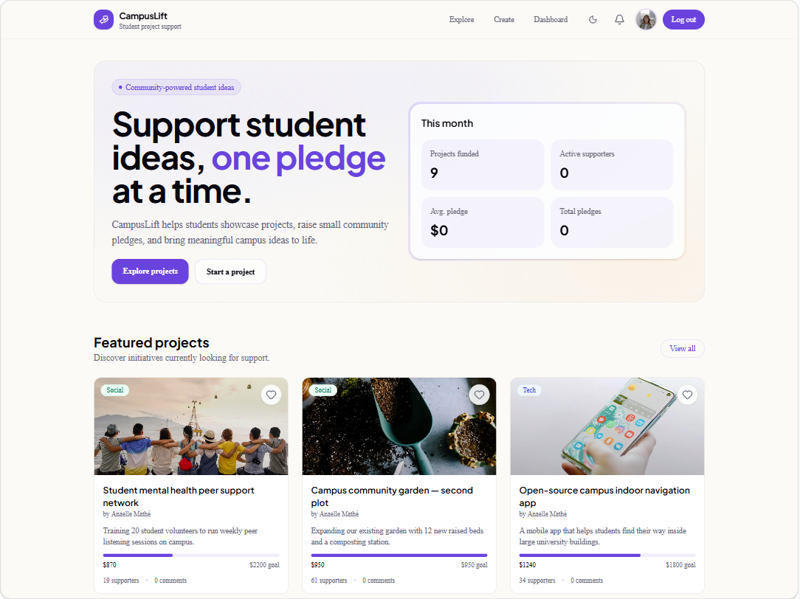

## Screenshots

| Light mode | Dark mode |
|:---:|:---:|
|  | 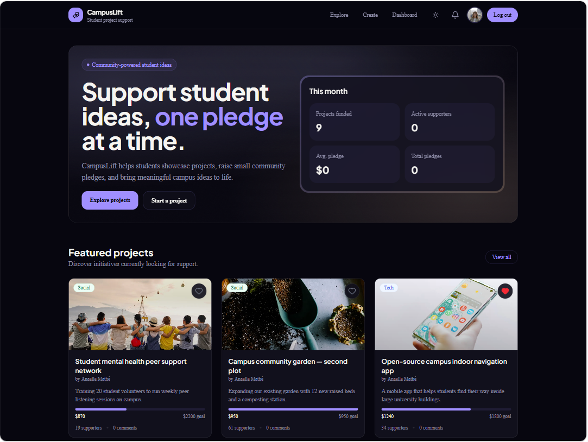 |
| 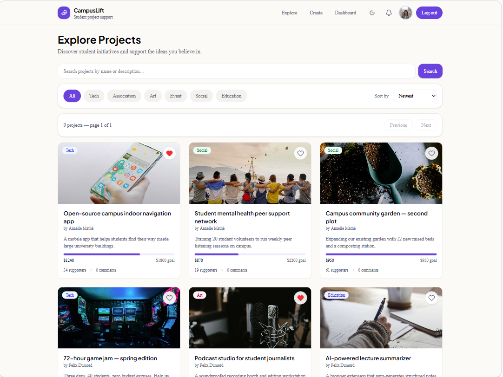 | 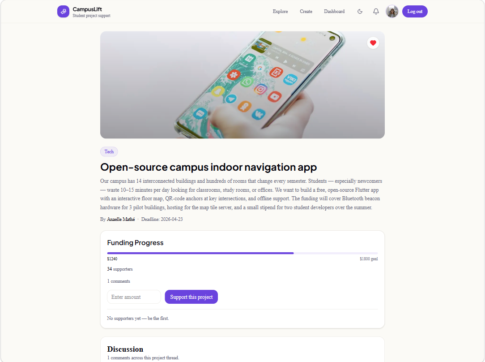 |
| 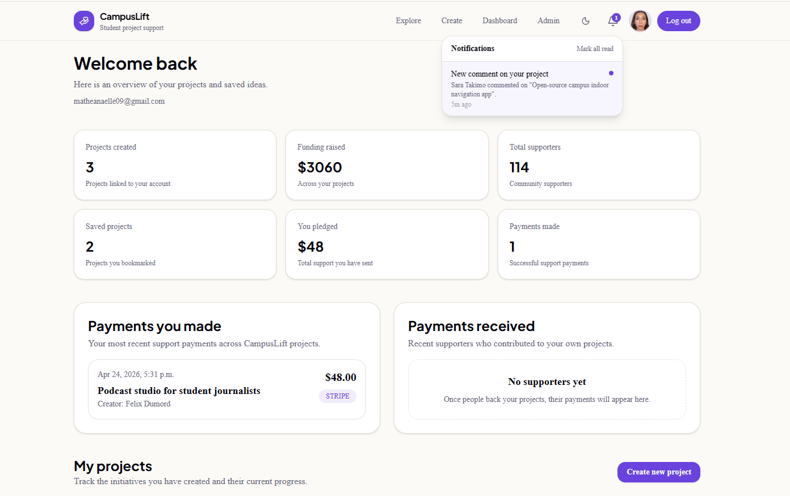 | 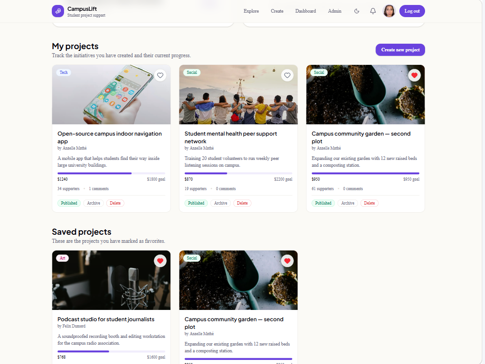 |
| 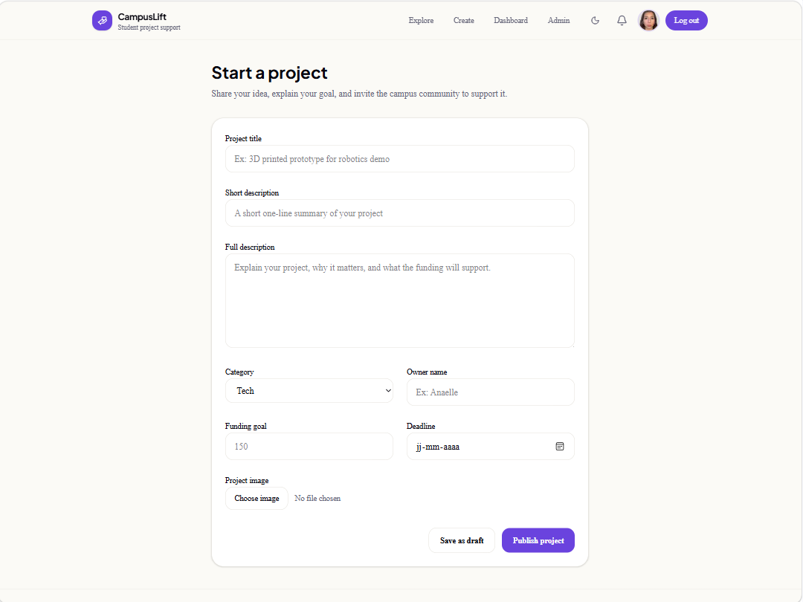 | 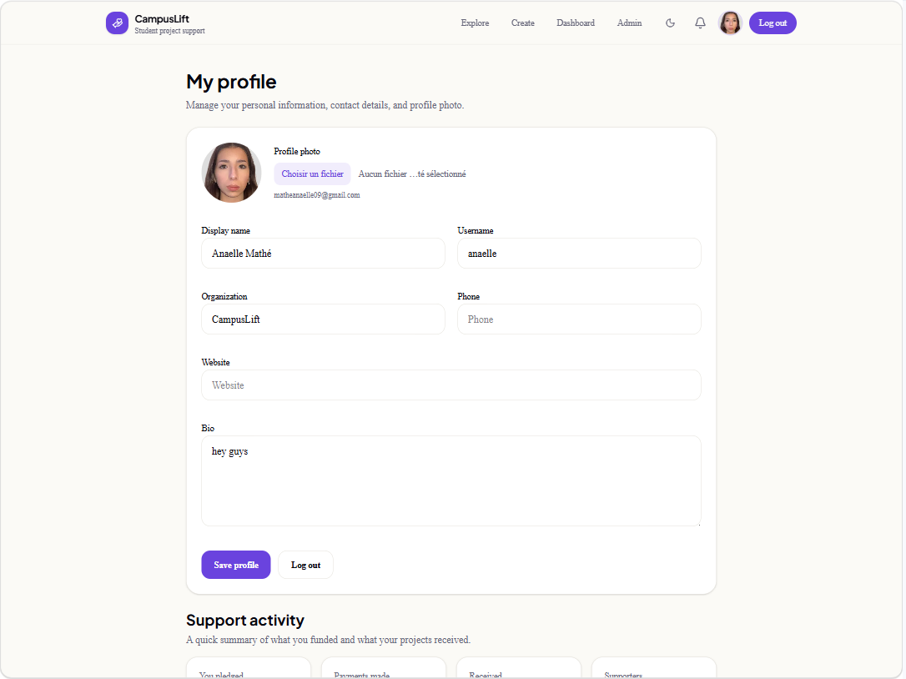 |
| 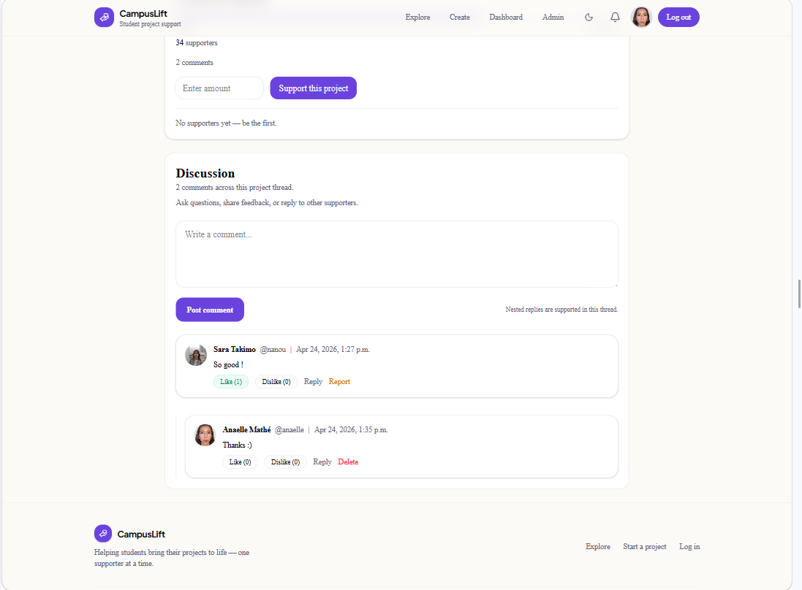 | 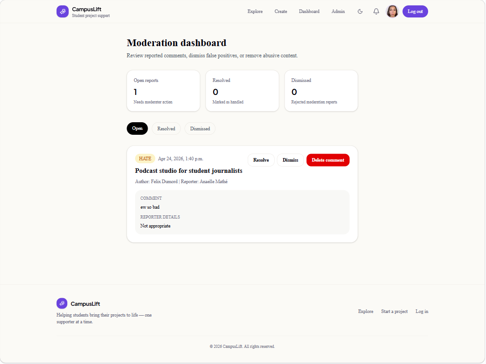 |

**Mobile**

| Homepage | Explore | Auth |
|:---:|:---:|:---:|
| 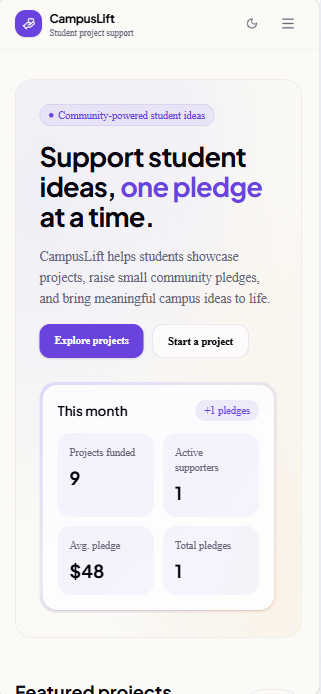 | 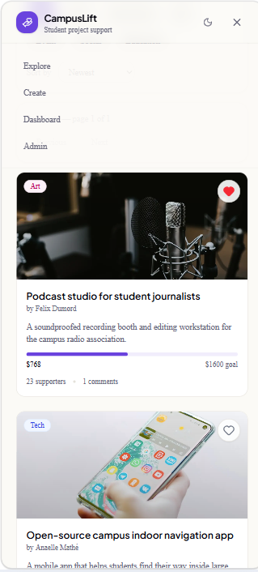 | 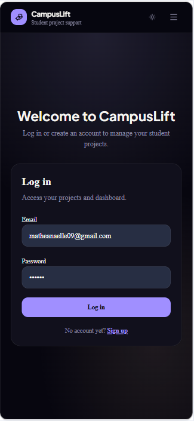 |

## Features

**For creators**
- Publish projects with images, descriptions, funding goals, and deadlines
- Manage project lifecycle: draft → published → archived
- Track funding progress with real-time counter updates via Supabase Realtime
- Receive email and in-app notifications when someone pledges
- View a creator dashboard with stats, payment history, and project management

**For supporters**
- Browse and search projects by category, keyword, and sort order
- Support projects through Stripe Checkout with test and live payment processing
- Save projects to favorites for later
- Participate in threaded comment discussions with likes, dislikes, and replies
- View personal donation history and profile

**For moderators**
- Review reported comments through a queue-based admin dashboard
- Resolve, dismiss, or delete reported content with one-click actions
- Role-based access control (user / admin)

**Infrastructure**
- Server-side mutations with rate limiting on all write routes
- Row Level Security on every table with optimized `(SELECT auth.uid())` policies
- Atomic pledge recording via SQL RPC functions (SECURITY DEFINER)
- Idempotent Stripe webhook handling with unique session ID constraint
- Dark mode with system preference detection
- Responsive mobile layout with hamburger menu
- OpenGraph and Twitter Card metadata for link previews
- CI pipeline: lint, typecheck, 109+ unit/component tests, E2E tests

## Tech Stack

| Layer | Technology |
|-------|-----------|
| Framework | Next.js 16 (App Router) + React 19 |
| Language | TypeScript (strict mode) |
| Styling | Tailwind CSS 4 + shadcn/ui + CSS variables (OKLCH) |
| Auth & DB | Supabase (Auth, Postgres 17, Storage, Realtime) |
| Payments | Stripe Checkout + webhooks |
| Email | Resend (optional) |
| Deployment | Vercel (auto-deploy on push) |
| CI | GitHub Actions (lint, typecheck, test, build) |
| Testing | Vitest + React Testing Library + Playwright |

## Architecture

```
src/
  app/            routes, layouts, pages, route handlers, loading/error boundaries
  components/     reusable UI (comments, projects, profile, layout, admin)
  features/       feature-oriented server logic
    auth/           session queries
    projects/       CRUD, status management, favorites
    donations/      Stripe checkout, pledge recording, hero stats
    comments/       threads, reactions, reports
    moderation/     admin review actions
    notifications/  in-app + email notifications
    profiles/       profile management
  lib/            infrastructure (supabase clients, stripe, rate limiter, env)
  types/          shared TypeScript types
docs/             architecture, database, design, deployment, testing
supabase/         SQL migrations + seed data
e2e/              Playwright end-to-end tests
```

Each feature owns its `actions.ts` (writes), `queries.ts` (reads), `schemas.ts` (validation), and `schemas.test.ts` (unit tests). Routes stay thin — they call features and compose UI.

See [architecture diagrams](docs/architecture-diagrams.md) for system flow, payment sequence, and module structure.

## Database

8 tables with full RLS coverage, 28 indexes, and 2 atomic RPC functions.

See [database ERD](docs/database-erd.md) for the full entity-relationship diagram and constraint details.

See [database notes](docs/database.md) for the migration inventory and operational details.

## Getting Started

### Prerequisites

- Node.js 20+
- npm
- A Supabase project
- A Stripe account (test mode)

### Environment Variables

```bash
cp .env.example .env.local
```

Required:
- `NEXT_PUBLIC_SUPABASE_URL`
- `NEXT_PUBLIC_SUPABASE_ANON_KEY`
- `SUPABASE_SERVICE_ROLE_KEY`
- `STRIPE_SECRET_KEY`
- `STRIPE_WEBHOOK_SECRET`

Optional:
- `STRIPE_CURRENCY` (default: `cad`)
- `NEXT_PUBLIC_APP_URL` (override for Stripe redirect URLs)
- `RESEND_API_KEY` (email notifications)

### Local Setup

```bash
# Install dependencies
npm install

# Apply SQL migrations from supabase/migrations/
# (run each file in order in the Supabase SQL Editor)

# Create at least one user account through the app

# Optionally seed demo data
# Run supabase/seed.sql in the SQL Editor

# Start the dev server
npm run dev
```

Open [http://localhost:3000](http://localhost:3000).

### Stripe Webhooks (Local)

```bash
stripe listen --forward-to localhost:3000/api/stripe/webhook
```

Copy the webhook signing secret into `STRIPE_WEBHOOK_SECRET`.

### Admin Access

```sql
UPDATE public.profiles
SET role = 'admin'
WHERE username = 'your_username';
```

Log out and back in after changing the role.

## Scripts

| Command | Description |
|---------|-------------|
| `npm run dev` | Start local dev server |
| `npm run build` | Production build |
| `npm run start` | Start production server |
| `npm run lint` | ESLint |
| `npm run typecheck` | Next.js typegen + tsc |
| `npm run test` | Vitest unit + component tests |
| `npm run test:watch` | Vitest in watch mode |
| `npm run test:e2e` | Playwright E2E tests |
| `npm run check` | Lint + typecheck + test |

## Testing

**109+ unit and component tests** covering validation schemas, rate limiting, hero stats computation, and interactive components (FavoriteButton, SupportProjectForm, ProjectProgress, CommentItem).

**E2E tests** with Playwright covering authentication flow, project creation with draft/publish, and project detail interactions (search, funding form, comments).

See [testing notes](docs/testing.md) for details.

## Documentation

| Document | Content |
|----------|---------|
| [Architecture](docs/architecture.md) | System design, rules, infrastructure boundaries |
| [Architecture Diagrams](docs/architecture-diagrams.md) | System flow, payment sequence, module structure |
| [Database](docs/database.md) | Migration inventory, RLS model, RPC functions |
| [Database ERD](docs/database-erd.md) | Entity-relationship diagram with constraints |
| [Product Design](docs/product-design.md) | Personas, user journeys, design decisions |
| [Deployment](docs/deployment.md) | Environment strategy, checklist, smoke tests |
| [Testing](docs/testing.md) | Test coverage, manual flows, gaps |
| [Product Roadmap](docs/product-roadmap.md) | Completed and planned work |
| [Release Checklist](docs/release-checklist.md) | Pre-push and pre-deploy verification |
| [Enterprise Report](docs/enterprise-project-report.md) | Initial code audit and improvement plan |
| [Contributing](CONTRIBUTING.md) | Setup, branching, quality checks |

## Product Design

CampusLift targets three user types: student creators who need funding, casual supporters who want to help, and faculty moderators who maintain platform trust.

See [product design](docs/product-design.md) for detailed personas, user journeys, and the rationale behind key technical decisions.

## Deployment

The app is deployed on Vercel with auto-deploy on push to main. Supabase provides the backend services. Stripe is configured in test mode.

See [deployment guide](docs/deployment.md) for the full environment strategy and verification checklist.

## License

This project is a personal portfolio build and is not licensed for redistribution.
