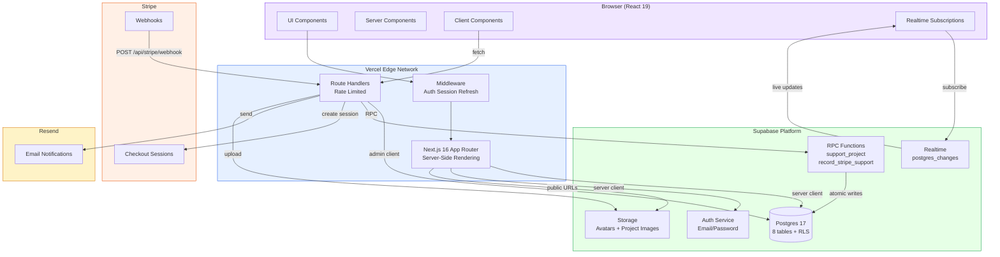
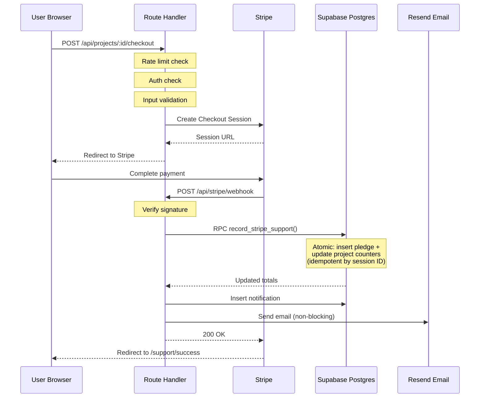
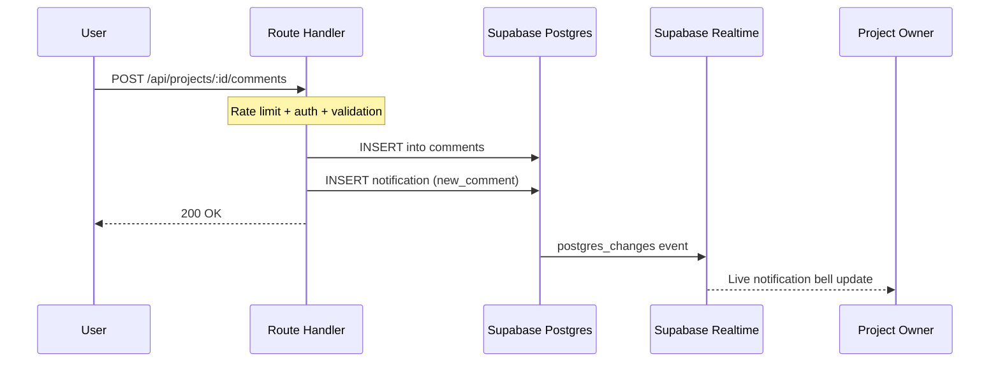
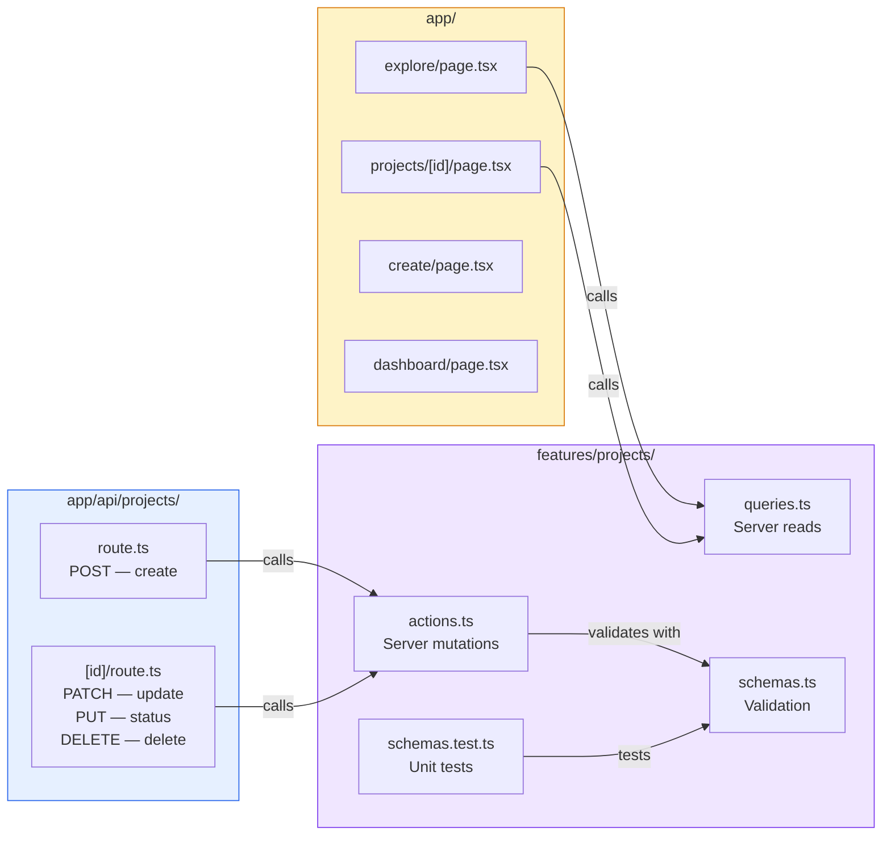

# Architecture Diagrams

## System Architecture

```mermaid
graph TB
    subgraph Client["Browser (React 19)"]
        UI[UI Components]
        RSC[Server Components]
        RCC[Client Components]
        RT[Realtime Subscriptions]
    end

    subgraph Vercel["Vercel Edge Network"]
        MW[Middleware<br/>Auth Session Refresh]
        SSR[Next.js 16 App Router<br/>Server-Side Rendering]
        API[Route Handlers<br/>Rate Limited]
    end

    subgraph Supabase["Supabase Platform"]
        Auth[Auth Service<br/>Email/Password]
        PG[(Postgres 17<br/>8 tables + RLS)]
        Storage[Storage<br/>Avatars + Project Images]
        Realtime[Realtime<br/>postgres_changes]
        RPC[RPC Functions<br/>support_project<br/>record_stripe_support]
    end

    subgraph Stripe["Stripe"]
        Checkout[Checkout Sessions]
        WH[Webhooks]
    end

    subgraph Resend["Resend"]
        Email[Email Notifications]
    end

    UI --> MW --> SSR
    RCC -->|fetch| API
    RT -->|subscribe| Realtime
    SSR -->|server client| PG
    SSR -->|server client| Auth
    API -->|admin client| PG
    API -->|RPC| RPC
    API -->|create session| Checkout
    WH -->|POST /api/stripe/webhook| API
    API -->|send| Email
    Realtime -->|live updates| RT
    RPC -->|atomic writes| PG
    SSR -->|public URLs| Storage
    API -->|upload| Storage

    style Client fill:#f0e6ff,stroke:#7c3aed
    style Vercel fill:#e6f0ff,stroke:#2563eb
    style Supabase fill:#e6ffe6,stroke:#16a34a
    style Stripe fill:#fff0e6,stroke:#ea580c
    style Resend fill:#fef3c7,stroke:#d97706
```

## Request Flow — Stripe Payment

```mermaid
sequenceDiagram
    participant U as User Browser
    participant API as Route Handler
    participant S as Stripe
    participant DB as Supabase Postgres
    participant E as Resend Email

    U->>API: POST /api/projects/:id/checkout
    Note over API: Rate limit check
    Note over API: Auth check
    Note over API: Input validation
    API->>S: Create Checkout Session
    S-->>API: Session URL
    API-->>U: Redirect to Stripe

    U->>S: Complete payment
    S->>API: POST /api/stripe/webhook
    Note over API: Verify signature
    API->>DB: RPC record_stripe_support()
    Note over DB: Atomic: insert pledge +<br/>update project counters<br/>(idempotent by session ID)
    DB-->>API: Updated totals
    API->>DB: Insert notification
    API->>E: Send email (non-blocking)
    API-->>S: 200 OK

    S-->>U: Redirect to /support/success
```

## Data Flow — Comment Thread

```mermaid
sequenceDiagram
    participant U as User
    participant API as Route Handler
    participant DB as Supabase Postgres
    participant RT as Supabase Realtime
    participant O as Project Owner

    U->>API: POST /api/projects/:id/comments
    Note over API: Rate limit + auth + validation
    API->>DB: INSERT into comments
    API->>DB: INSERT notification (new_comment)
    API-->>U: 200 OK

    DB->>RT: postgres_changes event
    RT-->>O: Live notification bell update
```

## Feature Module Structure

```mermaid
graph LR
    subgraph Feature["features/projects/"]
        A[actions.ts<br/>Server mutations]
        Q[queries.ts<br/>Server reads]
        S[schemas.ts<br/>Validation]
        T[schemas.test.ts<br/>Unit tests]
    end

    subgraph Routes["app/api/projects/"]
        R[route.ts<br/>POST — create]
        R2["[id]/route.ts<br/>PATCH — update<br/>PUT — status<br/>DELETE — delete"]
    end

    subgraph Pages["app/"]
        P1[explore/page.tsx]
        P2["projects/[id]/page.tsx"]
        P3[create/page.tsx]
        P4[dashboard/page.tsx]
    end

    R -->|calls| A
    R2 -->|calls| A
    P1 -->|calls| Q
    P2 -->|calls| Q
    A -->|validates with| S
    T -->|tests| S

    style Feature fill:#f0e6ff,stroke:#7c3aed
    style Routes fill:#e6f0ff,stroke:#2563eb
    style Pages fill:#fef3c7,stroke:#d97706
```
