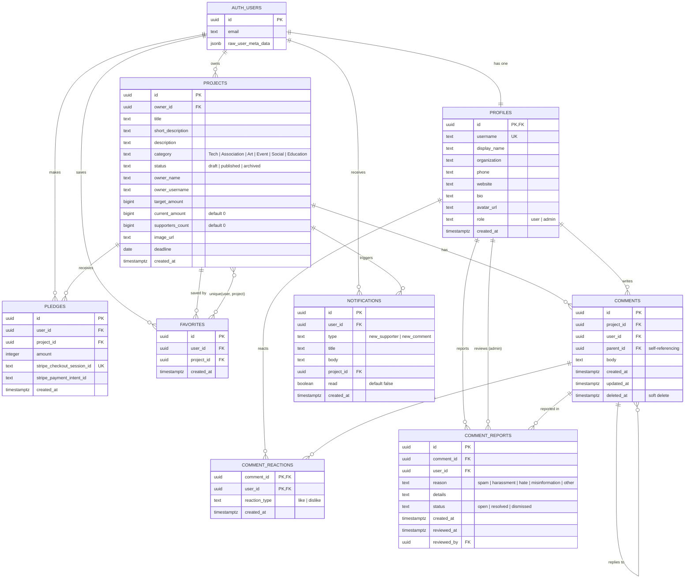

# Database Entity-Relationship Diagram

## Key Database Constraints

- All tables have **Row Level Security** enabled
- All RLS policies use `(SELECT auth.uid())` for optimal performance
- `support_project` RPC is **SECURITY DEFINER** — bypasses RLS to atomically update counters
- `record_stripe_support` is called by **service_role** which bypasses RLS
- `pledges.stripe_checkout_session_id` has a **unique partial index** for idempotent Stripe processing
- `profiles.username` has a **unique partial index** (WHERE username IS NOT NULL)
- `favorites` has a **unique constraint** on (user_id, project_id)
- Storage buckets enforce **file size limits** (5MB/10MB) and **MIME type restrictions** (image/* only)
- Avatar uploads are restricted to the **user's own folder** via storage RLS
